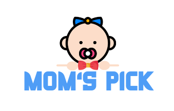

## 프로젝트 소개 📖
#### 육아용품 중고거래 웹서비스 「맘스픽」 
<div align=center>
  
</div>

- 프로젝트 기간 : **2023-10-10 ~ 2023-11-17** (7주, 6명)

- 주요 기능
    - 사용자 위치 기반 중고 육아용품 **거래 기능**
    - 판매자와 구매자 간 실시간 **채팅 기능**
    - **Elasticsearch**를 활용한 대용량 데이터의 빠른 검색 및 분석
    - FastAPI를 활용한 **상품 추천** 기능
    - 육아 **정보 제공** 

- 참조 리소스
    - 당근마켓
    - 맘맘   
<br>      

## 주요 기능 💻
|1. 로그인|2. 회원가입|
|:---:|:---:|
|||

|3. 메인페이지 |4. 검색 & 필터링|
|:---:|:---:|
|||

|5. 상세페이지|6. 채팅|
|:---:|:---:|
|||

|7-1. 육아정보|7-2. 육아정보|
|:---:|:---:|
|||

|8-1. 마이페이지|8-2. 마이페이지|
|:---:|:---:|
|||
<br>

## 주요 기술 🛠
#### 사용 툴
```
- Visual Studio Code, IntelliJ
- Git, GitLab
- Swagger
- Jira
- Notion
- Mattermost
- Figma
- AWS EC2
- AWS S3
- Jenkins
```

#### 사용 기술
```
- Java 11
- Spring Boot 2.7.17
- Spring Security
- WebSocket
- FastAPI
- JPA
- QueryDsl 
- ElasticSearch
- MySql 8.0.34
- Redis 3.0.504
- React 18
- Node.js 18.17.1
- Next.js 13.5.6
- Zustand 
- Tailwind CSS 
- typescript
```

#### 시스템 아키텍쳐


<br>

## 팀 구성 👨‍👨‍👦
<table align="center">
    <tr align="center">
        <td><a href="https://github.com/wnsdlf925">
            <br />
            <sub><b>권준일</b></sub></a>
            <br/> Backend / Infra 
        </td>
        <td><a href="https://github.com/ji-hyon">
            <br />
            <sub><b>서지현</b></sub></a>  
            <br /> Backend / Infra 
        </td>
        <td><a href="https://github.com/jhy1812">
            <br />
            <sub><b>정호윤</b></sub></a>
            <br /> Backend / Data  
        </td>
        <td><a href="https://github.com/JeBread">
            <br />
            <sub><b>방상제</b></sub></a>
            <br /> Frontend 
        </td>
        <td><a href="https://github.com/cjjss11">
            <br />
            <sub><b>최지수</b></sub></a>
            <br /> Frontend 
        </td>
        <td><a href="https://github.com/ChoiCharles">
            <br />
            <sub><b>최찬석</b></sub></a>
            <br /> Frontend 
        </td>
    </tr>
</table>

#### 담당 업무
```
권준일 
  - 데이터베이스 스키마 설계
  - 젠킨스를 활용한 CI/CD 구축
  - 아기 정보 API 개발
  - 사용자 위치 기반 물품 목록 조회 기능 개발
  - ElasticSearch를 이용한 검색 기능 개발
  
서지현 
  - 데이터베이스 스키마 설계
  - 인프라 초기 환경 설정 
  - 회원 도메인 기능 구현 (회원 가입, 로그인, 프로필 관리, 유저 간 상호 평가 등)
  - WebSocket을 활용한 실시간 채팅 기능 구현

정호윤 
  - 데이터베이스 스키마 설계
  - FastAPI를 활용한 추천 기능 개발
  - 육아 정보 기능 구현
  - 거래 도메인 기능 구현

방상제  
  - Figma 화면 설계 및 제작 
  - Zustand 상태 관리 
  - 거래 관련 기능 개발

최지수
  - Figma 화면 설계 및 제작 
  - 회원가입 페이지 구현
  - 마이페이지 구현
  - 육아 정보 페이지 구현 

최찬석  
  - Figma 화면 설계 및 제작 
  - 카카오맵 API를 활용한 지도 기능 구현
  - 채팅 관련 페이지 구현
  - 회원 관련 기능 개발 
```
